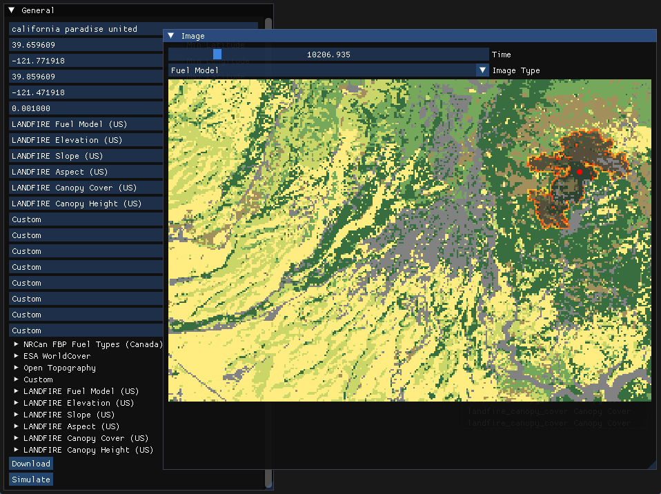

# Fire Simulator

High performance Rothermel fire simulator using Cadmium and GDAL



### Features

- Simulation parameters automatically fetched from public datasets
- Cell-DEVS simulation of Rothermel surface spread using the Behave model
- Low memory footprint (~22km area at 100m resolution never exceeded 1 GB)

### Datasets

- [LANDFIRE](https://landfire.gov) (fuel model, elevation, slope, aspect, canopy cover, canopy height)
- [NRCan](https://cwfis.cfs.nrcan.gc.ca) (fuel model)
- [ESA WorldCover](https://esa-worldcover.org) (fuel model)
- [OpenTopography](https://opentopography.org) (elevation, slope, aspect)
- [FIRMS](https://firms.modaps.eosdis.nasa.gov) (reference)
- [EONET](https://eonet.gsfc.nasa.gov) (reference)

### Building

#### Windows

```bash
git clone https://github.com/jsoulier/fire_simulator --recurse-submodules
cd fire_simulator
cmake --preset msvc
cmake --build --preset msvc-release
cd build/msvc/bin
./fire_simulator.exe
```

#### Linux

```bash
git clone https://github.com/jsoulier/fire_simulator --recurse-submodules
cd fire_simulator
cmake --preset clang-release
cmake --build --preset clang-release
cd build/clang-release/bin
./fire_simulator
```
